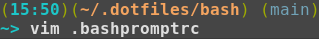

# bash

`bash` related settings.

## `.bashpromptrc`

Defines a bashprompt in the form of

It requires the terminal colors defined at
https://github.com/hagenw/bubblelights
to look like in the screenshot.

## `.bashrc`

Includes other programs
if available,
e.g. https://github.com/audeering/pyenvs.sh,
for which it sets the default Python version as well.

## `.dircolors`

Defines colors for different filetypes,
e.g. when listed by `ls`.

## `.inputrc`

Let the :arrow_up: and :arrow_down: keys
search in the bash history.
