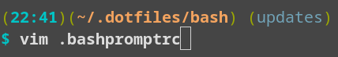

# bash

`bash` related settings.

## `.bashpromptrc`

Configures the bash prompt
to show the current folder
and git branch in the first line,
and the actual prompt in a second line.

The colors are optimized
for terminal colors as defined in
https://github.com/hagenw/bubblelights.

## `.bashrc`

Set more colors,
increase history size,
start or attach `tmux`.
Includes other programs
if available,
e.g. https://github.com/audeering/pyenvs.sh,
for which it sets the default Python version as well.

Set the following aliases

| Alias        | Command                                      | Description                         |
| ------------ | -------------------------------------------- | ----------------------------------- |
| `mutt`       | `neomutt`                                    | enforce neomutt on Debian           |
| `mc`         | `mc -d`                                      | disable mouse                       |
| `version`    | `lsb_release -a`                             | version of linux distribution       |
| `systeminfo` | `inxi -v5`                                   | hardware and driver infos           |
| `ls`         | `ls --color=auto --group-directories-first`  | use color and show folders first    |
| `df`         | `df -h`                                      | show size in human readable format  |
| `du`         | `du -h`                                      | show size in human readable format  |
| `docs`       | `xdg-open build/html/index.html &>/dev/null` | open sphinx docs in default browser |

## `.dircolors`

Defines colors for different filetypes,
e.g. when listed by `ls`.

## `.inputrc`

Use <kbd>↑</kbd> and <kbd>↓</kbd> keys
to navigate the bash history.
You can start typing a command,
and then use the keys.
