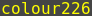
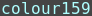
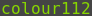

# tmux config files

Meaningful default settings for tmux.
The color of the window name in the tmux status bar
is set to .

If you want to use `tmux` on servers,
that you access from your local `tmux` session,
you might want to change the color setting
for them to 
or .

Keybindings without prefix key.

| Keybinding                                               | Description               |
| -------------------------------------------------------- | ------------------------- |
| <kbd><kbd>CTRL</kbd>+<kbd>→</kbd></kbd>                  | next window               |
| <kbd><kbd>CTRL</kbd>+<kbd>←</kbd></kbd>                  | previous window           |
| <kbd><kbd>CTRL</kbd>+<kbd>↑</kbd></kbd>                  | new window                |
| <kbd><kbd>CTRL</kbd>+<kbd>End</kbd></kbd>                | last selected window      |
| <kbd><kbd>CTRL</kbd>+<kbd>Home</kbd></kbd>               | first window              |

Keybindings with prefix <kbd><kbd>CTRL</kbd>+<kbd>a</kbd></kbd> key.

| Keybinding                                                | Description               |
| --------------------------------------------------------- | ------------------------- |
| <kbd><kbd>CTRL</kbd>+<kbd>a</kbd> <kbd>n</kbd></kbd>      | next window               |
| <kbd><kbd>CTRL</kbd>+<kbd>a</kbd> <kbd>b</kbd></kbd>      | previous window           |
| <kbd><kbd>CTRL</kbd>+<kbd>a</kbd> <kbd>l</kbd></kbd>      | last selected window      |
| <kbd><kbd>CTRL</kbd>+<kbd>a</kbd> <kbd>End</kbd></kbd>    | last selected window      |
| <kbd><kbd>CTRL</kbd>+<kbd>a</kbd> <kbd>Home</kbd></kbd>   | first window              |
| <kbd><kbd>CTRL</kbd>+<kbd>a</kbd> <kbd>Insert</kbd></kbd> | new window                |
| <kbd><kbd>CTRL</kbd>+<kbd>a</kbd> <kbd>Delete</kbd></kbd> | kill window               |
| <kbd><kbd>CTRL</kbd>+<kbd>a</kbd> <kbd>k</kbd></kbd>      | kill window               |
| <kbd><kbd>CTRL</kbd>+<kbd>a</kbd> <kbd>q</kbd></kbd>      | kill window               |
| <kbd><kbd>CTRL</kbd>+<kbd>a</kbd> <kbd>-</kbd></kbd>      | split window vertically   |
| <kbd><kbd>CTRL</kbd>+<kbd>a</kbd> <kbd>v</kbd></kbd>      | split window vertically   |
| <kbd><kbd>CTRL</kbd>+<kbd>a</kbd> <kbd>\|</kbd></kbd>     | split window horizontally |
| <kbd><kbd>CTRL</kbd>+<kbd>a</kbd> <kbd>h</kbd></kbd>      | split window horizontally |
| <kbd><kbd>CTRL</kbd>+<kbd>a</kbd> <kbd>f</kbd></kbd>      | toggle pane fullscreen    |
| <kbd><kbd>CTRL</kbd>+<kbd>a</kbd> <kbd>p</kbd></kbd>      | cycle panes               |
| <kbd><kbd>CTRL</kbd>+<kbd>a</kbd> <kbd>←</kbd></kbd>      | left pane                 |
| <kbd><kbd>CTRL</kbd>+<kbd>a</kbd> <kbd>→</kbd></kbd>      | right pane                |
| <kbd><kbd>CTRL</kbd>+<kbd>a</kbd> <kbd>↑</kbd></kbd>      | top pane                  |
| <kbd><kbd>CTRL</kbd>+<kbd>a</kbd> <kbd>↓</kbd></kbd>      | bottom pane               |
