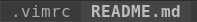
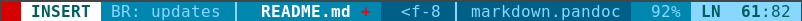

# VIM config files

VIM configuration,
extensions,
and color theme.

The used color theme is
[bubblelights](https://github.com/hagenw/bubblelights),
which requires to
[update your terminal colors](https://github.com/hagenw/bubblelights?tab=readme-ov-file#terminal-color-palette)
as well.

The configuration expects
that files for spell checking
are available under
`~/.local/share/vim/spell`.

## Keyboard short cuts

| Keyboard short cut                       | Description                              |
| ---------------------------------------- | ---------------------------------------- |
| <kbd>,</kdb>                             | leader key                               |
| <kbd><kbd>,</kbd> <kbd>k</kbd></kbd>     | show all available leader commands       |
| <kbd><kbd>,</kbd> <kbd>r</kbd></kbd>     | replace highlighted word                 |
| <kbd><kbd>CTRL</kbd>-<kbd>r</kbd></kbd>  | replace highlighted word                 |
| <kbd><kbd>,</kbd> <kbd>q</kbd></kbd>     | close current tab/buffer                 |
| <kbd><kbd>,</kbd> <kbd>c</kbd></kbd>     | close quick fix window                   |
| <kbd><kbd>,</kbd> <kbd>e</kbd></kbd>     | execute open file                        |
| <kbd><kbd>,</kbd> <kbd>l</kbd></kbd>     | toggel line numbers                      |
| <kbd><kbd>,</kbd> <kbd>f</kbd></kbd>     | quickly open files                       |
| <kbd><kbd>,</kbd> <kbd>b</kbd></kbd>     | quickly open buffer                      |
| <kbd>F8</kbd>                            | lint with `ruff`                         |
| <kbd><kbd>,</kbd> <kbd>F8</kbd></kbd>    | format and fix with `ruff`               |
| <kbd><kbd>,</kbd> <kbd>n</kbd></kbd>     | move to next quick fix entry             |
| <kbd><kbd>z</kbd> <kbd>g</kbd></kbd>     | add word to known words for spellchecker |
| <kbd><kbd>z</kbd> <kbd>w</kbd></kbd>     | mark word as wrong for spellchecker      |
| <kbd>n</kbd>                             | move to next searched word below         |
| <kbd>N</kbd>                             | move to next searched word above         |
| <kbd>\\</kbd>                            | clear word search                        |
| <kbd><kbd>CTRL</kbd>+<kbd>y</kbd></kbd>  | copy to clip board                       |
| <kbd><kbd>CTRL</kbd>+<kbd>n</kbd></kbd>  | go to next open file/buffer              |
| <kbd><kbd>CTRL</kbd>+<kbd>b</kbd></kbd>  | go to previous open file/buffer          |
| <kbd><kbd>,</kbd> <kbd>,</kbd></kbd>     | switch to last open file in buffer       |
| <kbd><kbd>ALT</kbd>+<kbd>↑</kbd></kbd>   | go to split window above                 |
| <kbd><kbd>ALT</kbd>+<kbd>↓</kbd></kbd>   | go to split window below                 | 
| <kbd><kbd>ALT</kbd>+<kbd>←</kbd></kbd>   | go to split window left                  |
| <kbd><kbd>ALT</kbd>+<kbd>→</kbd></kbd>   | go to split window right                 |
| <kbd>+</kbd>                             | increase window size                     |
| <kbd>-</kbd>                             | decrease window size                     |
| <kbd>_</kbd>                             | make window fullscreen                   |
| <kbd><kbd>AltGr</kbd>+<kbd>u</kbd></kbd> | ü                                        |
| <kbd><kbd>AltGr</kbd>+<kbd>o</kbd></kbd> | ö                                        |
| <kbd><kbd>AltGr</kbd>+<kbd>a</kbd></kbd> | ä                                        |
| <kbd>F5</kbd>                            | color highlighting for an open CSV file  |

## Provided extensions

| Plugin                                                    | Description                              |
| --------------------------------------------------------- | ---------------------------------------- |
| [BufTabLine](https://github.com/ap/vim-buftabline)        |        |
| [ack](https://github.com/mileszs/ack.vim)                 | run your favorite search tool from vim   |
| [ale](https://github.com/dense-analysis/ale)              | code linting and formatting              |
| [rainbow_csv](https://github.com/mechatroner/rainbow_csv) | CSV color highlighting                   |
| [powerline](https://github.com/powerline/powerline)       |  |
